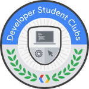

<h2 align="center">

 
:confetti_ball: :tada: 30 Days Code Challenge :tada: :confetti_ball:
</h2>

### Complete this following task below to get win a Free DSC Swag, complete bonus tasks and get an extra sticker :wink:

#### Tasks :octocat:

> _Before you start make sure you have git installed in your laptop, if you don't have git installed, [click here](https://git-scm.com/book/en/v2/Getting-Started-Installing-Git) to get it_

1. _Fork_ this repository to your account (learn how to fork repositories [here](https://help.github.com/en/articles/fork-a-repo)).

2. _Clone_ your forked repo to your laptop (learn how to clone [here](https://help.github.com/en/articles/cloning-a-repository)).

3. Create a _Folder in your Your full Name_ in the repository.

4. Add an _aboutme.md_ file in your folder, write your _Name, Email Address and write a little about yourself. (see example folder)_

5. When done Create a folder that will contain your code for either of the project below (_choose one or more, the more the task the more the points_):
   
   * Create a todo list using either _Android or Web_ (_4 points_)
   * Create a Stylesheet using css grid on for _Web_ (_2 points_)
   * Create a Portfolio _website_ (_3 points bonus_ )

6. Once completed Add your Full Name to the [complete.md](completed.md) file, **Push** (_[how to push](https://help.github.com/en/articles/pushing-to-a-remote)_) your code and create a **Pull request** (_[How to pull request](https://help.github.com/en/articles/creating-a-pull-request-from-a-fork)_).

7. :rocket: Tweet about your completed tasks using the hash tag **#30DaysChallenge #DSCYabatech @DSCYabatech #DSCSSA**

> Once Complete we would send you a mail congratulating you on your completion as you automaically qualify to pick up your prize after the 30Days Challenge has ended.
>  Lets get the party started :sparkle: :sparkle: :rocket: :rocket: :octocat: